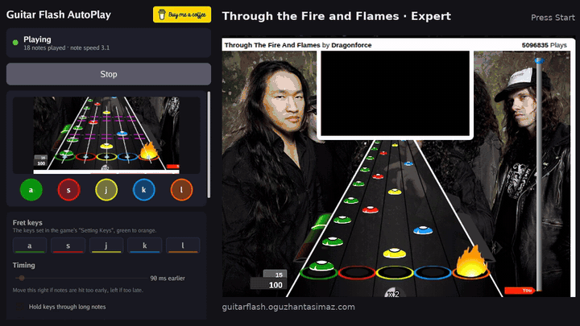
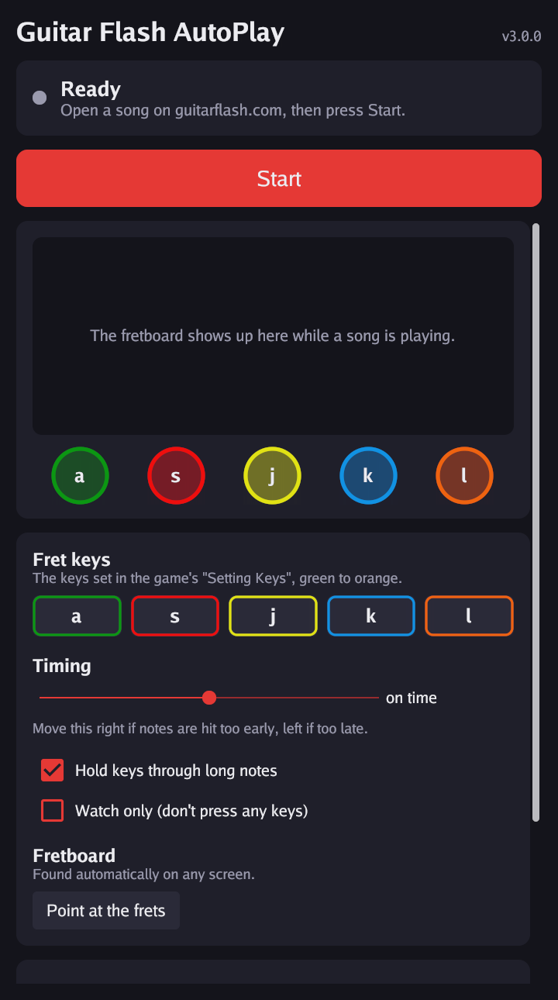

# Guitar Flash AutoPlay

An example app that plays [Guitar Flash](https://guitarflash.com) by itself on
**Windows** and **macOS**. It watches the screen, sees the notes coming down
the fretboard and presses the fret keys at the right moment.

It finds the fretboard on its own, so there are **no coordinates to edit**: it
works at any screen resolution, browser zoom level, Retina / HiDPI screen,
Windows display scaling (100% – 200%) and on multi-monitor setups. It also
measures how fast the notes scroll, so the timing is right on every
difficulty.

<p align="center"><a href="https://guitarflash.oguzhantasimaz.com/#watch"></a></p>
<p align="center"><em>Through the Fire and Flames on Expert.
<a href="https://guitarflash.oguzhantasimaz.com/#watch">Watch the highlights</a> (73 s, from one full run at 99%) or
<a href="site/video/demo.mp4">download the video</a>.</em></p>

<p align="center"></p>

**Website and downloads:** <https://guitarflash.oguzhantasimaz.com/>
· [Watch it play on YouTube](https://youtube.com/shorts/noo72JP1h3k?feature=share "Working Example")

<a href="https://buymeacoffee.com/oguzhantasimaz"></a>

> This is a fun project to show how screen-reading bots work. Please don't use
> it to submit scores to the rankings or in multiplayer duels.

## Quick start

### 1. Download

Get the zip for your system from the [Releases](../../releases) page (or from
the latest run on the [Actions](../../actions) tab, under *Artifacts*):

| System | File |
| --- | --- |
| Windows (most PCs) | `guitarflash-autoplay-windows-x64.zip` |
| Windows on ARM | `guitarflash-autoplay-windows-arm64.zip` |
| macOS (Apple Silicon and Intel) | `guitarflash-autoplay-macos.zip` |

### 2. Open it

**Windows**

1. Unzip and double-click **`Guitar Flash AutoPlay.exe`**.
2. If Windows shows *"Windows protected your PC"*, click **More info →
   Run anyway**. The app is not signed, which is why Windows warns about it.

**macOS**

1. Unzip and move **`Guitar Flash AutoPlay.app`** to *Applications*.
2. The app is not notarized by Apple, so the first time macOS refuses to open
   it. Open **System Settings → Privacy & Security**, scroll down and click
   **Open Anyway** next to the message about Guitar Flash AutoPlay. (Or run
   `xattr -dr com.apple.quarantine "/Applications/Guitar Flash AutoPlay.app"`
   in Terminal.)
3. The app asks for two permissions. Turn both on for *Guitar Flash AutoPlay*
   in **System Settings → Privacy & Security** (the window has buttons that
   open the right page), then quit and reopen the app:
   - **Screen & System Audio Recording**, so it can see the game
   - **Accessibility**, so it can press keys

### 3. Play

1. Place the app's window next to the browser, not on top of the game.
2. Open [guitarflash.com](https://guitarflash.com) and pick a song. Use the
   **Tap** game style (the default). Expert is the most fun to watch.
3. Press **Start**, then **click on the game** within 3 seconds so the
   browser gets the keyboard.
4. The status turns green (*Playing*), the fretboard shows up in the window
   and the five lights flash as the app presses each key.

To stop, press **Stop**, or **move the mouse to the top-left corner** of the
screen. The app keeps running between songs: when the fretboard disappears it
goes back to searching and picks up the next song on its own.

## The window

- **Fret keys**: the five keys, green to orange. Change them if you changed
  *Setting Keys* in the game.
- **Timing**: moves every key press later or earlier, up to 100 ms. Leave it
  on time unless notes are consistently hit a little early or late (it
  depends a bit on the computer and the browser).
- **Hold keys through long notes**: holds the key while the tail of a
  sustained note goes by, for the extra points. Turn it off to only tap.
- **Watch only**: follows the notes and lights up the keys it would press,
  without pressing them. Handy to check that the fretboard is found.
- **Point at the frets**: if the fretboard is never found automatically,
  hold the mouse over the green and then the orange fret when asked.

The settings are saved for next time. The log at the bottom says what the app
is doing.

## Command line

The same program also runs in a terminal: start it with any option and it
skips the window. On Windows use `guitarflash-autoplay.exe` from the zip; on
macOS the `guitarflash-autoplay` file next to the app. Run it with `-h` to see
every option.

| Option | What it does |
| --- | --- |
| `-keys a,s,j,k,l` | The five fret keys, green to orange (e.g. `-keys 1,2,3,4,5`). |
| `-offset 15ms` | Press every note later (`15ms`) or earlier (`-15ms`). |
| `-no-hold` | Tap every note instead of holding keys through sustained notes. |
| `-display 1` | Only look at one display (0 is the main one). |
| `-calibrate` | Point at the green and orange frets with the mouse instead of detecting them. |
| `-frets x1,y1,x2,y2` | Give the green and orange fret centres directly (printed by `-calibrate`). |
| `-dry-run` | Watch and report, but don't press keys. |
| `-debug` | Log every key press and save `guitarflash-debug.png` showing what was detected. |
| `-analyze shot.png` | Run detection on a screenshot file and save `shot-debug.png`. Works on any OS. |

In a terminal, stop with **Ctrl+C**. On macOS the permissions then belong to
your terminal app (Terminal, iTerm, …) instead of Guitar Flash AutoPlay.

On macOS, keys are sent by their position on a US keyboard, so on other
layouts pick the key that sits where the US key would be.

## How it works

For everyone who asked "how do you do this?", here is the whole idea. The
code is small and commented, so it's a good place to start reading too.

**1. Find the fretboard.** The game draws into a fixed 822×580 canvas that
the browser scales up or down, so the layout never changes, only its size and
position. The app takes a screenshot and looks for the five fret rings:
blobs of green, red, yellow, blue and orange, shaped like flat ellipses,
evenly spaced on one line. That gives the position of every fret and the
**spacing** between them ([`internal/vision/board.go`](internal/vision/board.go)).

**2. Measure everything in "fret spacings".** From then on, every distance is
a multiple of the spacing, never a pixel count, and that's what makes it work
at every resolution. The highway is drawn in perspective: its edges meet 4.44
spacings above the frets, so a lane at height `h` is squeezed by
`1 - h / 4.44` towards the middle.

```
            \    \   |   /    /       the lanes meet 4.44 spacings up
         ....\....\..|../..../....    upper sensor line, 1.9 spacings above the frets
              \    \ | /    /
          .....\....\|/..../.....     lower sensor line, 1.05 spacings above the frets
               (G) (R) (Y) (B) (O)    fret rings, 1 spacing apart
```

**3. Follow every gem.** Around two sensor lines above the frets the app
reads a short stretch of each lane, over a hundred times a second, capturing
only those pixels. In every frame it finds the coloured body of each gem in
view; the white cap and the dark highway keep neighbours apart, even in the
fastest runs of *Through the Fire and Flames*, where the gems on one lane
almost touch. Gems only ever move down, so from one frame to the next the
app works out how far they moved and which gem is which, and notes the
moment each gem's leading edge crosses a sensor line, interpolated between
frames. The sensors sit above the flame the game draws on a hit (it reaches
0.8 spacings up), and a separate strip on the lower line watches the thin
tail of sustained notes to know how long to hold a key
([`internal/vision/column.go`](internal/vision/column.go),
[`internal/engine/tracker.go`](internal/engine/tracker.go)).

**4. Measure the speed.** Every note crosses the upper sensor first and the
lower one a moment later. That travel time, averaged over recent notes, says
how fast the song scrolls, so it adapts to every difficulty without any
setting.

**5. Press on time.** Notes are drawn in perspective: slow at the far end of
the highway, faster near the frets. So instead of assuming a constant speed,
the app uses a ratio measured on the game: from the lower sensor, a note
needs 1.45 times its upper-to-lower travel time to look centred on its fret.
The game counts a hit about 0.1 s before that, so the key goes down 120 ms
earlier. The app holds the key while a sustain tail passes, and ignores the
white flash of special effects ([`internal/engine`](internal/engine)).

These numbers were measured by running the app against the real game in a
browser and timing notes frame by frame. With them it plays whole songs on
Expert: *Through the Fire and Flames* at 99% (2350 of 2354 notes) and
*Breakthrough* at 99% (507 of 508 notes), in a test browser without a
graphics card that draws only about 40–50 frames per second.

How early the key has to go down depends a little on the computer. The
game moves its notes a fixed step per drawn frame, so on a browser that
draws slowly they fall behind the music and the best moment to press
shifts. If notes are hit a little early or late, move the **Timing** slider
(or use `-offset`).

**Resolution and DPI details.** On Windows the app declares itself DPI aware,
so screenshots and coordinates are real pixels even at 150% scaling. On
macOS it works in points (the "looks like" resolution), so Retina screens
behave like any other.

## Troubleshooting

- **"Looking for the fretboard" forever**: make sure the whole fretboard
  (all five rings) is visible and not covered by another window, including
  this app's. On macOS, check the Screen Recording permission. You can also
  take a screenshot and run `guitarflash-autoplay -analyze shot.png` to see
  what the app sees. As a last resort, *Point at the frets*.
- **It plays but no keys arrive**: click on the game so the browser has
  keyboard focus. On macOS, check the Accessibility permission. Make sure the
  fret keys match the game's *Setting Keys*.
- **Notes are missed or hit early/late**: move the *Timing* slider (or use
  `-offset`), close heavy programs, and keep the browser tab in front.

## Build from source

You need [Go](https://go.dev/dl/) 1.23 or newer.

```sh
git clone https://github.com/oguzhantasimaz/Guitar-Flash-AutoPlay
cd Guitar-Flash-AutoPlay
go build ./cmd/guitarflash-autoplay
```

- **Windows** needs nothing else; no C compiler is required. You can even
  build it from macOS or Linux with `GOOS=windows go build ./cmd/guitarflash-autoplay`.
  Add `-ldflags -H=windowsgui` for a build that opens without a console.
- **macOS** needs the Xcode command line tools (`xcode-select --install`)
  because it calls CoreGraphics. The release workflow shows how the `.app`
  bundle and its icon are put together.
- **Linux** works too, experimentally and on X11 only (the window toolkit,
  [Gio](https://gioui.org), needs `libwayland-dev libx11-dev libx11-xcb-dev
  libxkbcommon-x11-dev libgles2-mesa-dev libegl1-mesa-dev libffi-dev
  libxcursor-dev libvulkan-dev` to build). It also runs under `Xvfb`, which is
  how the app was tested against the real game without a screen.

Run the tests with `go test ./...`. They run on any OS, and draw synthetic
fretboards at sizes from tiny to 4K. To look at the window without a screen,
render it to PNG files:
`GF_UI_SNAPSHOT=/tmp/shots go test -run Snapshots ./internal/ui`.

To publish a release with ready-made downloads, push a tag and GitHub Actions
builds and uploads everything:

```sh
git tag v3.0.0 && git push origin v3.0.0
```

### Project layout

| Path | What's inside |
| --- | --- |
| `cmd/guitarflash-autoplay` | Starts the window, or the command line when given options |
| `internal/ui` | The window ([Gio](https://gioui.org)) and its saved settings |
| `internal/player` | The bot itself: find the board, follow the notes, press the keys |
| `internal/vision` | Finding the fretboard and reading the lanes (pure Go, no OS code) |
| `internal/engine` | Note tracking, speed measurement and key-press timing (pure Go) |
| `internal/platform` | Screen capture, key presses and permissions for Windows, macOS and Linux (X11) |
| `assets`, `tools/mkicon` | The icon (drawn by code), the macOS `Info.plist`, the Windows manifest |
| `site` | The website, published to GitHub Pages by `.github/workflows/pages.yml` |

## History

I first wrote this bot at university in March 2020, back before AI could
write code for you. It meant a lot to me then, and I always wanted to come
back and build it properly.

- **v1, March 2020: Python.** One file of about 50 lines
  ([`guitarflash.py`](https://github.com/oguzhantasimaz/Guitar-Flash-AutoPlay/blob/6c6fba1/guitarflash.py)), committed just after midnight and signed
  `#OĞUZHAN TAŞIMAZ 29.03.2020`. It grabbed a strip of a 1920×1080 screen,
  checked one pixel above each fret and pressed the key when it turned
  bright. It only worked at that resolution, with the browser at 100% zoom.
- **v2, September 2023: Go.** The same idea, smoother
  ([`main.go`](https://github.com/oguzhantasimaz/Guitar-Flash-AutoPlay/blob/d5bd080/main.go), [video](https://youtube.com/shorts/noo72JP1h3k)): one
  goroutine per lane, a fixed 100 ms wait before each key and a check that
  skips the white flashes. The coordinates still had to be edited by hand
  for every screen.
- **v3, September 2026: rebuilt from scratch** as the app I always wanted it
  to be: a window for Windows and macOS that finds the fretboard on any
  screen, measures the note speed and follows every gem. This time I built
  it together with an AI pair programmer. The core idea is still v1's: watch
  the frets, and press when a note arrives.

Feel free to contribute! If the app is useful to you, you can
[buy me a coffee](https://buymeacoffee.com/oguzhantasimaz).
